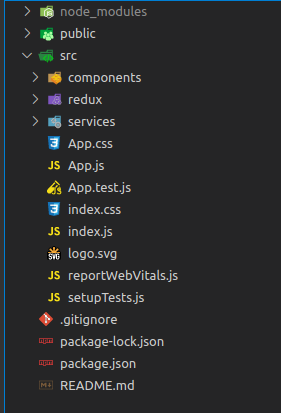

## Site em React para consulta de CEP :desktop_computer:

Olá seja bem vindo ao repositorio do projeto React consulta CEP. :rocket:

Este projeto consiste em um site em React onde e possível consultar cep de qualquer
Localidade do Brasil. Foi utilizada um API pública, que pode ser consultada 
[aqui](https://apicep.com/api-de-consulta/).
Siga no readme e veja como o Projeto está estruturado.

## Estrutura

Esta estrutura é a padrão de projetos React.

1. PUBLIC: Pasta onde ficam arquivos estáticos e imagens do projeto.
2. COMPONENTS: Pasta onde ficam os componetes utilizados na estrutura do projeto.
3. REDUX: Pasta onde ficam as estruturas de gerenciamento de estado da aplicação.
4. SERVICES: Pasta onde ficam as funçoes de conexão e serviços de API'S.

## tecnologias utilizadas

- Linguagens:
  - JavaScript
- Estilos:
  - Bootstrap
- Organização e Padronização de codigo:
  - Eslint / config-airbnb-base

## Começando

- Clone o repositório git clone git@github.com:clebertonf/project-CEP-react.git
- Na raiz do projeto rode o comando npm install para instalar as depedências do projeto.

## Executando

- `"npm start": Inicia o projeto React na porta padrão 3000 `

## Funcionalidade principal

Na pagina inicial digite um CEP valido com somente os números

Exemplos de Cep Válidos:

O cep e validado com um REGEX.
Caso seja passado campo vazio ou CEP inválido, a seguinte messagem e retornada:

